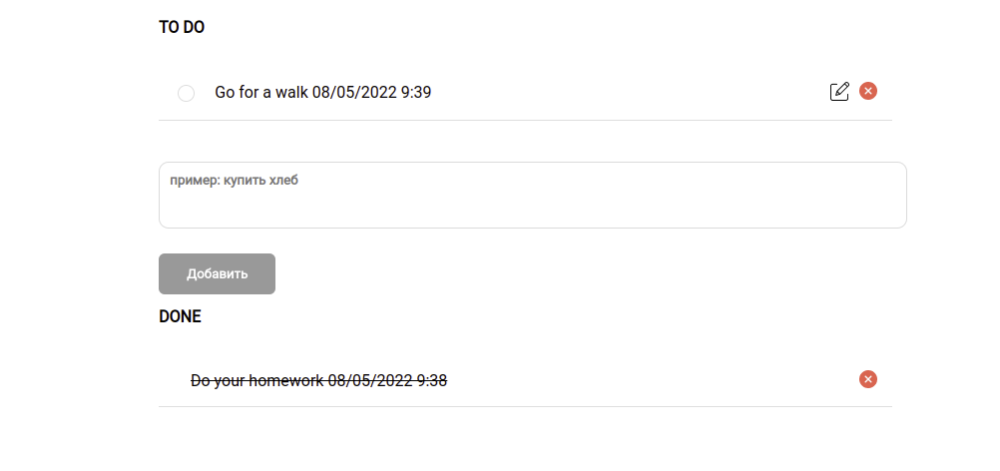

# TODOLIST
This is my first todolist project implemented with HTML, CSS, JS.
 
 

 
 
## Functionality
Functionality of this project allows  you to:
- add your task and get a reminder within 10 seconds;
- edit your task and save it;
- delete your task;
- move your task to the DONE section;
## Launching
Launch `index.html` on liveserver.